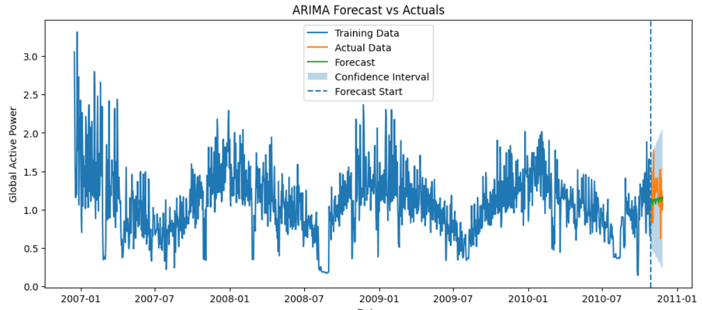

# ⚡ Time Series Forecasting of Electricity Consumption

## 📊 Forecast Visualization

---

## 📌 Project Overview

Developed a time series forecasting model capturing trend and seasonality patterns to generate accurate short-term electricity consumption predictions using ARIMA/SARIMAX models on a large-scale dataset (~2M records).

---

## 🎯 Business Impact

Enables data-driven energy consumption planning by identifying usage patterns and generating reliable short-term forecasts.

---

## 📂 Dataset

- **Source:** UCI Machine Learning Repository  
- **Granularity:** Minute-level household electricity consumption  
- **Size:** ~2 million records  

> Dataset not included due to size. Can be downloaded from UCI repository.

---

## ⚙️ Workflow Summary

### 1️⃣ Data Preprocessing
- Handled missing values  
- Converted numeric columns  
- Combined `Date` and `Time` into `Datetime`  
- Set time index for analysis  

---

### 2️⃣ Feature Engineering
- Extracted: Year, Month, Day, Hour, Week, Quarter  
- Created time-based insights  

---

### 3️⃣ Trend & Seasonality Analysis
- Rolling statistics  
- Seasonal decomposition  
- Pattern identification  

---

### 4️⃣ Stationarity Check
- Augmented Dickey-Fuller (ADF) test  
- Applied differencing where required  

---

### 5️⃣ Forecasting Model
- ARIMA / SARIMAX modeling  
- Auto ARIMA for parameter tuning  
- Forecast generation with confidence intervals  

---

### 6️⃣ Model Evaluation
- Compared actual vs predicted values  
- Metrics: MAE, RMSE  
- Residual analysis  

---

## 📊 Key Insights

- Strong seasonal patterns observed in electricity consumption  
- Trend variations captured effectively after resampling  
- Forecast closely follows actual values in short-term horizon  

---

## 🛠️ Technologies Used

- Python  
- Pandas, NumPy  
- Matplotlib, Seaborn  
- Statsmodels, pmdarima  
- Scikit-learn  
- Jupyter Notebook  

---

## 🚀 Future Improvements

- Integrate external features (weather, holidays)  
- Apply advanced models (SARIMA, Prophet)  
- Improve long-term forecasting accuracy  

---

## 📬 Contact

Feel free to connect for feedback or collaboration!
